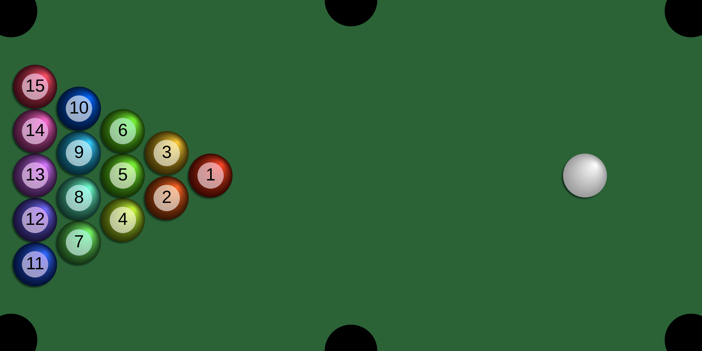

# Sphere Collision

A JavaScript 2D experiment with physics.

[Live version](https://victorribeiro.com/sphereCollision)

## About

This experiment could be used to create several other game projects like pool, golf, marbles...

## How to play / interact

Click / touch on the sphere and drag the mouse / finger to where you want the sphere to go. Faster movement means stronger force.
